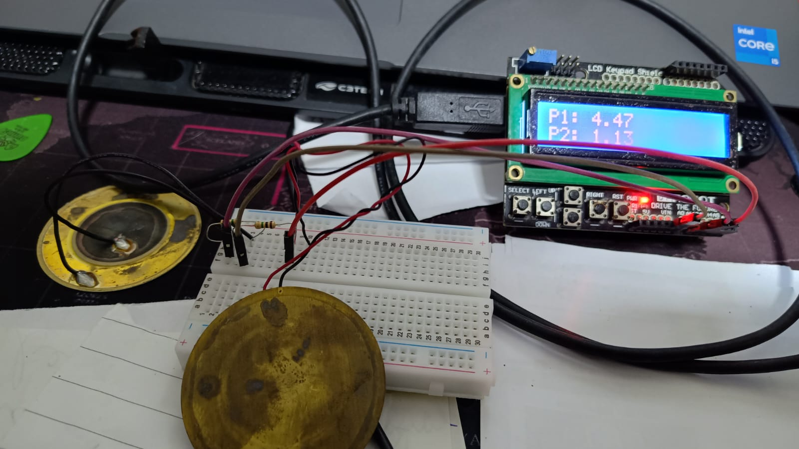

Projeto para mensurar força de impacto em uma superfície.
Utiliza duas (ou mais) cápsulas piezoelétricas como sensores de impacto em pontos diferentes da superfície, frontal e traseira.

O objetivo é medir a força remanescente após o impacto:
primeiro piezo é instalado na face da superfície, o mais próximo da área de impacto.
o segundo piezo é instalado na traseira da superfície, onde será absorvida a energia remanescente do impacto.

É possível utilizar os botões UP e DOWN do keypad para ajustar a sensibilidade (threshold) e SELECT para resetar o valor.

## Diagrama de ligação:

  

"PiezoBefore" (Primeiro Piezo):  
Signal (positivo): Connectado em A1 (Analog pin) da placa.   
Ground (negativo): Connected em resistor 1MΩ.  
A outra perna do resistor é conectada ao Ground(GND) da placa.  

"PiezoAfter" (Segundo Piezo):  
Signal (positivo): Connectado em A2 (Analog pin) da placa.  
Ground (negativo): Connected em resistor 1MΩ.  
A outra perna do resistor é conectada ao Ground(GND) da placa (pode ser conectado ao mesmo Ground depois do resistor e compartilhar Ground com o primeiro piezo).  

## Projeto:

  

  

